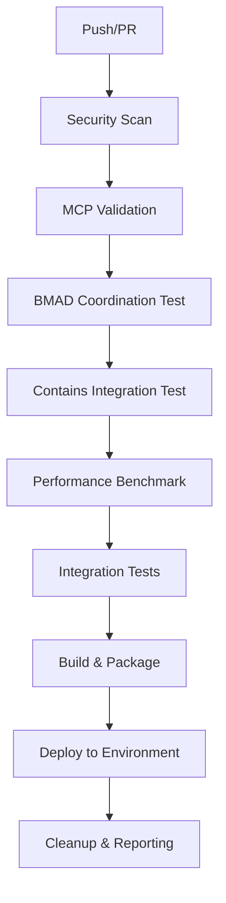
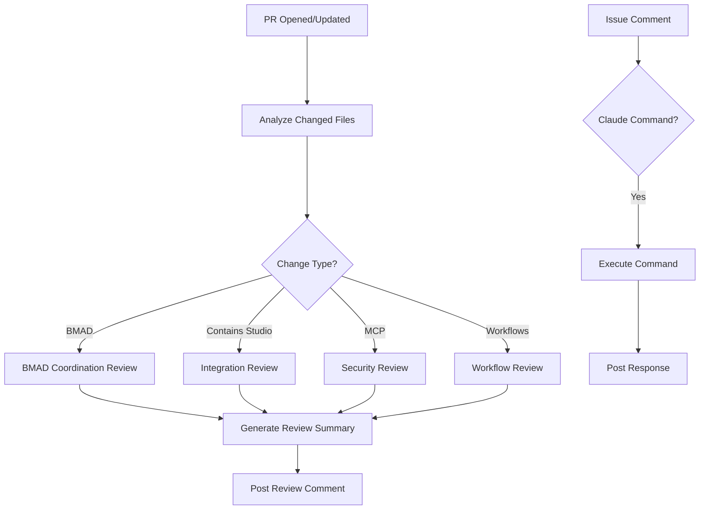
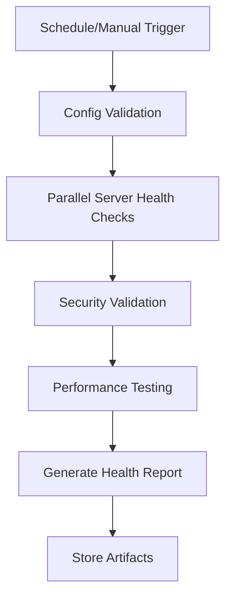
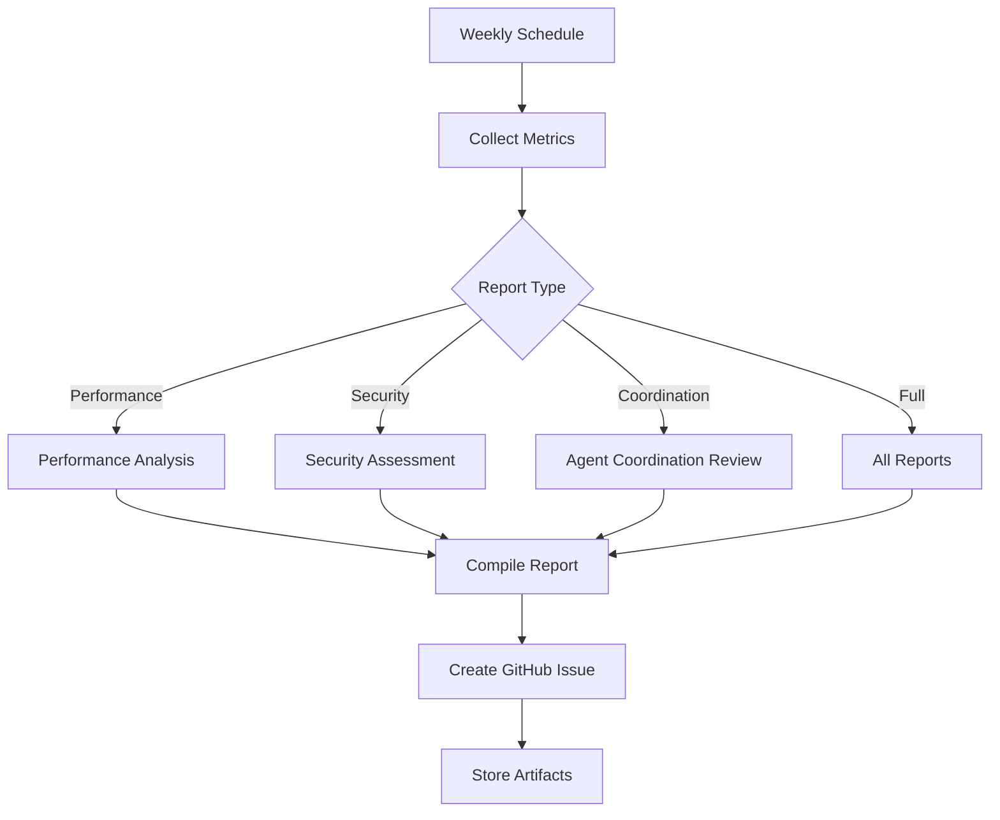

# 🚀 BMAD+Contains Studio CI/CD Workflows

This directory contains comprehensive GitHub Actions workflows for the BMAD+Contains Studio+MCP ecosystem automation.

## 📋 Workflow Overview

### Core Workflows

| Workflow | Trigger | Purpose | Duration |
|----------|---------|---------|----------|
| **bmad-ci.yml** | Push/PR | Main CI/CD pipeline with security, testing, deployment | ~8-12 min |
| **claude-code-pr-review.yml** | PR events | Automated intelligent code review | ~2-3 min |
| **mcp-validation.yml** | Schedule/MCP changes | MCP servers health monitoring | ~5-7 min |
| **weekly-reports.yml** | Weekly schedule | Comprehensive system reporting | ~10-15 min |

## 🔄 CI/CD Pipeline Architecture

### Main CI/CD Flow (bmad-ci.yml)



#### Pipeline Stages

1. **Security & Vulnerability Analysis**
   - Secret scanning with TruffleHog
   - MCP security configuration validation
   - Permissions matrix verification
   - Enterprise security posture check

2. **MCP Servers Validation**
   - Individual server health checks (8 servers)
   - Configuration validation
   - Availability testing
   - Parallel execution for speed

3. **Agent Coordination Testing**
   - BMAD workflow configuration validation
   - Agent harmonization pack testing
   - Coordination pattern verification

4. **Integration Validation**
   - Contains Studio agent integration
   - Cross-agent permission validation
   - System harmony verification

5. **Performance Benchmarking**
   - Workflow parsing performance
   - Agent coordination latency
   - Memory usage analysis
   - Response time validation

6. **Build & Deployment**
   - Artifact creation and packaging
   - Version tagging and metadata
   - Environment-specific deployment
   - Post-deployment validation

### PR Review Automation (claude-code-pr-review.yml)



#### Review Categories

- **BMAD Coordination**: Workflow changes, agent configuration, orchestration patterns
- **Contains Studio Integration**: Agent harmony, permission boundaries, integration patterns
- **MCP Security**: Configuration changes, security posture, compliance validation
- **GitHub Workflows**: YAML validation, pipeline integrity, automation patterns

### MCP Health Monitoring (mcp-validation.yml)



#### Health Check Matrix

| MCP Server | Validation Type | Frequency |
|------------|----------------|-----------|
| GitHub | Command availability, NPX validation | Every 6h |
| Firecrawl | Service availability, package validation | Every 6h |
| PostgreSQL | Environment config, connection params | Every 6h |
| Redis | Connection string, database config | Every 6h |
| Notion | API token validation, permissions | Every 6h |
| ShadCN | Package availability, component validation | Every 6h |
| Filesystem | Path permissions, security boundaries | Every 6h |
| Memory | Service availability, persistence config | Every 6h |

### Weekly Reporting (weekly-reports.yml)



## 🎯 Usage Guidelines

### Triggering Workflows

#### Automatic Triggers
- **Push to main/develop**: Triggers full CI/CD pipeline
- **Pull Request**: Triggers PR review and validation
- **MCP file changes**: Triggers MCP validation
- **Schedule**: Weekly reports every Monday 9 AM UTC

#### Manual Triggers
```bash
# Trigger main CI/CD pipeline
gh workflow run bmad-ci.yml

# Generate specific report type
gh workflow run weekly-reports.yml -f report_type=security

# Run comprehensive MCP validation
gh workflow run mcp-validation.yml -f validation_level=comprehensive
```

### Interactive Claude Commands

Use in PR comments to trigger specific actions:

```
/claude review        # Detailed code review
/claude bmad         # BMAD coordination analysis
/claude contains     # Contains Studio integration check
/claude security     # Security validation
/claude mcp          # MCP server validation
/claude help         # Show available commands
```

## 🔒 Security & Compliance

### Security Validation Pipeline

1. **Secret Detection**: TruffleHog integration for credential scanning
2. **Configuration Validation**: MCP security posture verification
3. **Permissions Audit**: Agent permission matrix validation
4. **Compliance Check**: SOC2, ISO27001, GDPR, NIST CSF validation

### Security Gates

- All security scans must pass before deployment
- MCP configurations require enterprise zero-trust posture
- Audit logging must be enabled with 7-year retention
- Mutual TLS authentication required for all MCP servers

## 📊 Monitoring & Observability

### Metrics Collection

#### Development Velocity
- Commit frequency and patterns
- PR creation and merge rates
- Agent-specific activity tracking
- Cross-agent collaboration metrics

#### System Performance
- CI/CD pipeline execution times
- Agent coordination latency
- MCP server response times
- Resource utilization patterns

#### Security Posture
- Security scan results and trends
- Compliance status tracking
- Vulnerability detection and resolution
- Incident response metrics

### Alerting & Notifications

#### Critical Alerts
- Security scan failures
- MCP server health issues
- Pipeline execution failures
- Compliance violations

#### Weekly Reports
- Comprehensive system health reports
- Performance trend analysis
- Security posture summaries
- Agent coordination effectiveness

## 🚀 Deployment Strategies

### Environment Progression

```
Development → Staging → Production
     ↓           ↓         ↓
  Fast CI/CD   Full CI/CD  Blue-Green
  Basic Tests  All Tests   Zero Downtime
  Quick Deploy Gate Deploy Canary Deploy
```

### Deployment Gates

1. **Security Gate**: All security validations pass
2. **Quality Gate**: Performance benchmarks meet thresholds
3. **Integration Gate**: Agent coordination tests pass
4. **Approval Gate**: Manual approval for production

### Rollback Strategy

- **Automated Rollback**: On health check failures
- **Manual Rollback**: Via workflow dispatch
- **Blue-Green**: Zero-downtime rollback capability
- **Database Rollback**: Coordinated with application rollback

## 🔧 Troubleshooting

### Common Issues

#### CI/CD Pipeline Failures
```bash
# Check workflow logs
gh run list --workflow=bmad-ci.yml

# View specific run details
gh run view [RUN_ID] --log
```

#### MCP Validation Failures
```bash
# Manual MCP validation
npm install -g @modelcontextprotocol/cli
mcp validate project.mcp.json
```

#### Security Scan Issues
```bash
# Run local security scan
truffleHog --regex --entropy=False .
```

### Performance Optimization

#### Pipeline Speed
- Use parallel job execution
- Optimize Docker layer caching
- Implement incremental builds
- Cache dependencies effectively

#### Agent Coordination
- Minimize cross-agent communication overhead
- Optimize MCP server response times
- Implement intelligent scheduling
- Monitor resource utilization

## 📚 Additional Resources

- [BMAD Core Documentation](../.bmad-core/README.md)
- [Contains Studio Guide](../agents-harmonization-pack/README.md)
- [MCP Security Configuration](../security/README.md)
- [Claude Code Integration](../CLAUDE.md)

---

*🤖 This CI/CD system provides comprehensive automation for the BMAD+Contains Studio+MCP ecosystem with enterprise-grade security, monitoring, and deployment capabilities.*