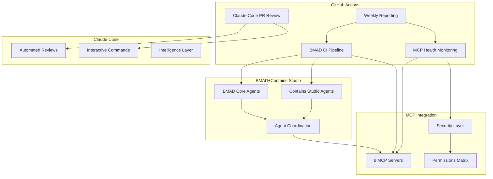
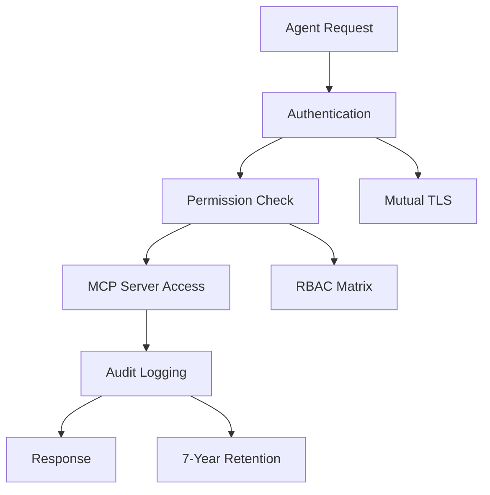
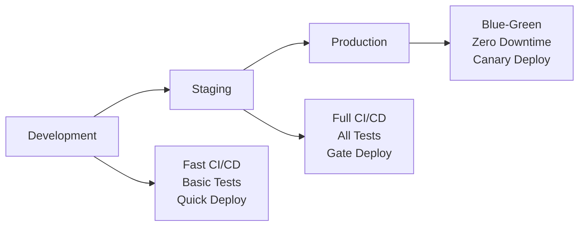

# 🚀 BMAD+Contains Studio CI/CD Integration Guide

## 🎯 Overview

This comprehensive guide explains how to use, configure, and optimize the CI/CD workflows for the BMAD+Contains Studio+MCP ecosystem. The automation system provides enterprise-grade DevOps capabilities with Claude Code intelligence integration.

## 🏗️ Architecture Overview

### System Components



## 🚀 Quick Start

### 1. Repository Setup

Ensure your repository has the required structure:

```bash
# Clone and verify structure
git clone <repository-url>
cd bmoremad-template

# Verify required files exist
ls -la .github/workflows/
ls -la .bmad-core/
ls -la project.mcp.json
ls -la CLAUDE.md
```

### 2. Initial Validation

Run the integration test suite to validate your setup:

```bash
# Make sure test script is executable
chmod +x scripts/test-workflows.sh

# Run comprehensive tests
./scripts/test-workflows.sh
```

Expected output:
```
✅ All integration tests passed!
✅ BMAD+Contains Studio CI/CD workflows are ready for deployment
```

### 3. First Deployment

Create your first pull request to trigger the automation:

```bash
# Create feature branch
git checkout -b feature/test-ci-cd-integration

# Make a small change
echo "# CI/CD Integration Test" >> test-integration.md

# Commit and push
git add test-integration.md
git commit -m "Test CI/CD integration with BMAD+Contains Studio"
git push origin feature/test-ci-cd-integration

# Create PR via GitHub CLI
gh pr create --title "Test CI/CD Integration" --body "Testing automated workflows"
```

## 🔄 Workflow Deep Dive

### Main CI/CD Pipeline (bmad-ci.yml)

#### Workflow Stages

**Stage 1: Security & Vulnerability Analysis**
```yaml
Purpose: Validate security posture and scan for vulnerabilities
Duration: ~2-3 minutes
Triggers: All pushes and PRs
```

**Stage 2: MCP Servers Validation** 
```yaml
Purpose: Health check all 8 MCP servers in parallel
Duration: ~3-4 minutes
Parallel: Yes (8 concurrent jobs)
```

**Stage 3: BMAD Coordination Test**
```yaml
Purpose: Validate agent coordination workflows
Duration: ~1-2 minutes
Dependencies: Security scan passed
```

**Stage 4: Contains Studio Integration Test**
```yaml
Purpose: Verify Contains Studio agent integration
Duration: ~1-2 minutes  
Dependencies: BMAD coordination passed
```

**Stage 5: Performance Benchmarking**
```yaml
Purpose: Measure system performance metrics
Duration: ~2-3 minutes
Thresholds: <5000ms total benchmark time
```

**Stage 6: Integration Tests**
```yaml
Purpose: End-to-end system validation
Duration: ~2-3 minutes
Coverage: All agent interactions
```

**Stage 7: Build & Package**
```yaml
Purpose: Create deployment artifacts
Duration: ~1-2 minutes
Triggers: main/develop branch only
```

**Stage 8: Deployment**
```yaml
Purpose: Deploy to target environment
Duration: ~3-5 minutes
Strategy: Blue-green with rollback capability
```

#### Configuration Options

Customize the pipeline by modifying environment variables:

```yaml
env:
  NODE_VERSION: '20'          # Node.js version
  PYTHON_VERSION: '3.11'     # Python version  
  CACHE_VERSION: v1           # Cache invalidation
```

### Claude Code PR Review (claude-code-pr-review.yml)

#### Automated Review Process

**File Analysis Categories:**
- **BMAD Changes**: Workflow configurations, agent definitions
- **Contains Studio Changes**: Agent integrations, coordination patterns
- **MCP Changes**: Server configurations, security settings
- **Security Changes**: Security policies, compliance settings
- **Workflow Changes**: CI/CD pipeline modifications

**Review Output Example:**
```markdown
# 🤖 Claude Code Automated Review

## Summary
This PR modifies BMAD coordination patterns and Contains Studio integration.

### Analysis Results:
## 🧠 BMAD Coordination Review
- ✅ BMAD workflow modifications found
- 🔍 Reviewing coordination patterns...

## 🏗️ Contains Studio Integration Review  
- ⚡ Agent coordination updates detected
- 🔄 Ensuring BMAD+Contains Studio harmony...
```

#### Interactive Commands

Use these commands in PR comments:

```bash
/claude review        # Trigger detailed analysis
/claude bmad         # Focus on BMAD coordination
/claude contains     # Check Contains Studio integration
/claude security     # Security-focused review
/claude mcp          # MCP configuration validation
/claude help         # Show all available commands
```

### MCP Health Monitoring (mcp-validation.yml)

#### Health Check Matrix

| Server | Validation Type | Health Criteria |
|--------|----------------|-----------------|
| **GitHub** | NPX availability | Command execution |
| **Firecrawl** | Package validation | Service availability |
| **PostgreSQL** | Environment config | Connection parameters |
| **Redis** | Connection string | Database configuration |
| **Notion** | API token | Permission validation |
| **ShadCN** | Package availability | Component validation |
| **Filesystem** | Path permissions | Security boundaries |
| **Memory** | Service availability | Persistence configuration |

#### Manual Health Check

Trigger comprehensive validation:

```bash
# Run standard validation
gh workflow run mcp-validation.yml

# Run comprehensive validation
gh workflow run mcp-validation.yml \
  -f validation_level=comprehensive

# Run security-focused validation  
gh workflow run mcp-validation.yml \
  -f validation_level=security-focused
```

### Weekly Reporting (weekly-reports.yml)

#### Report Types

**Performance Report**
```yaml
Metrics: Development velocity, CI/CD performance, agent coordination
Schedule: Every Monday 9 AM UTC
Retention: 90 days
```

**Security Report**
```yaml
Metrics: Security posture, compliance status, incident tracking
Schedule: Every Monday 9 AM UTC  
Retention: 90 days
```

**Coordination Report**
```yaml
Metrics: Agent interactions, workflow efficiency, system harmony
Schedule: Every Monday 9 AM UTC
Retention: 90 days
```

**Full Report**
```yaml
Metrics: All above reports combined with executive summary
Schedule: Every Monday 9 AM UTC
Retention: 90 days
```

#### Manual Report Generation

```bash
# Generate full report for last week
gh workflow run weekly-reports.yml

# Generate specific report type
gh workflow run weekly-reports.yml \
  -f report_type=performance

# Generate report for specific week (2 weeks ago)
gh workflow run weekly-reports.yml \
  -f report_type=full \
  -f week_offset=2
```

## 🔒 Security Integration

### Enterprise Zero Trust Architecture



#### Security Validation Process

1. **Configuration Validation**
   - Security posture check (`enterprise_zero_trust`)
   - Encryption standards validation (TLS 1.3)
   - Audit logging verification

2. **Permission Matrix Validation**
   - Agent-specific permissions
   - Resource isolation boundaries
   - Cross-agent access controls

3. **Compliance Validation**
   - SOC2 compliance check
   - ISO27001 standards
   - GDPR data protection
   - NIST Cybersecurity Framework

#### Security Configuration

Edit `project.mcp.json` security section:

```json
{
  "mcp_security": {
    "security_posture": "enterprise_zero_trust",
    "access_control": {
      "encrypted_connections": "TLS_1_3",
      "authentication_method": "mutual_tls",
      "authorization_model": "zero_trust_rbac"
    },
    "audit_logging": {
      "enabled": true,
      "retention_years": 7,
      "real_time_processing": true
    }
  }
}
```

## 📊 Monitoring & Observability

### Key Performance Indicators

#### Development Velocity
- **Commits per week**: Target >15 for high velocity
- **PR merge rate**: Target >80% within 24 hours
- **CI/CD success rate**: Target >95%
- **Agent coordination efficiency**: <100ms average

#### System Health
- **MCP server uptime**: Target >99.9%
- **Security scan pass rate**: Target 100%
- **Workflow execution time**: Target <10 minutes
- **Error rate**: Target <1%

#### Business Metrics
- **Feature delivery rate**: Deployments per week
- **Quality metrics**: Bug detection rate
- **Security posture**: Zero critical vulnerabilities
- **Compliance status**: 100% compliant

### Monitoring Dashboard

Access monitoring data through:

1. **GitHub Actions Dashboard**: Workflow execution history
2. **Weekly Reports**: Comprehensive system health
3. **MCP Health Reports**: Server-specific metrics
4. **Security Reports**: Compliance and threat analysis

## 🚀 Deployment Strategies

### Environment Progression



#### Development Environment
- **Purpose**: Rapid iteration and testing
- **CI/CD**: Basic validation, fast feedback
- **Security**: Standard security checks
- **Deployment**: Direct deployment

#### Staging Environment  
- **Purpose**: Pre-production validation
- **CI/CD**: Full pipeline with all tests
- **Security**: Comprehensive security validation
- **Deployment**: Gated deployment with approvals

#### Production Environment
- **Purpose**: Live system operation
- **CI/CD**: Complete pipeline with performance gates
- **Security**: Enterprise security validation
- **Deployment**: Blue-green with zero downtime

### Deployment Configuration

Configure deployment targets in workflow files:

```yaml
# Production deployment
deploy:
  name: Deploy to Production
  environment: production  # Requires approval
  if: github.ref == 'refs/heads/main'
  
# Staging deployment  
deploy-staging:
  name: Deploy to Staging
  environment: staging
  if: github.ref == 'refs/heads/develop'
```

## 🔧 Troubleshooting Guide

### Common Issues & Solutions

#### 1. CI/CD Pipeline Failures

**Symptom**: Pipeline fails at security scan
```bash
# Check security scan logs
gh run list --workflow=bmad-ci.yml --limit=1
gh run view [RUN_ID] --log --job=security-scan
```

**Solution**: Verify MCP security configuration
```bash
# Validate MCP security settings
jq '.mcp_security.security_posture' project.mcp.json
# Should return: "enterprise_zero_trust"
```

#### 2. MCP Server Health Check Failures

**Symptom**: MCP validation fails for specific servers
```bash
# Check MCP validation logs
gh run view [RUN_ID] --log --job=mcp-server-health
```

**Solution**: Verify server configuration
```bash
# Check specific server config
jq '.mcpServers.github' project.mcp.json

# Validate all servers
./scripts/test-workflows.sh
```

#### 3. Claude Code Review Issues

**Symptom**: PR review comments not appearing
```bash
# Check PR review workflow
gh run list --workflow=claude-code-pr-review.yml
```

**Solution**: Verify GitHub permissions
```yaml
# Ensure proper permissions in workflow
permissions:
  contents: read
  pull-requests: write
  issues: write
```

#### 4. Weekly Report Generation Failures

**Symptom**: Reports not generated on schedule
```bash
# Check weekly reports workflow
gh run list --workflow=weekly-reports.yml
```

**Solution**: Verify schedule syntax and dependencies
```yaml
# Correct cron syntax for Mondays 9 AM UTC
schedule:
  - cron: '0 9 * * 1'
```

### Performance Optimization

#### Pipeline Speed Optimization

1. **Parallel Execution**: Maximize concurrent jobs
2. **Caching**: Cache dependencies and build artifacts
3. **Incremental Builds**: Only build changed components
4. **Artifact Optimization**: Minimize artifact sizes

#### Agent Coordination Optimization

1. **MCP Response Times**: Optimize server configurations
2. **Permission Caching**: Cache permission lookups
3. **Workflow Optimization**: Streamline coordination patterns
4. **Resource Management**: Optimize memory and CPU usage

## 📚 Advanced Configuration

### Custom Agent Integration

Add new agents to the system:

1. **Define Agent Configuration**
```json
// Add to project.mcp.json permissions_matrix
"custom-agent-group": {
  "github": ["read"],
  "postgres": ["read", "write"],
  "redis": ["read"]
}
```

2. **Update Workflow Validation**
```yaml
# Add to workflow validation steps
- name: Validate Custom Agent
  run: |
    echo "Validating custom agent integration..."
```

3. **Configure Claude Code Awareness**
```markdown
<!-- Add to CLAUDE.md -->
#### Custom Agents
- `custom-agent-name` - Agent purpose and capabilities
```

### Environment-Specific Configuration

Configure different environments:

```yaml
# Environment matrix in workflows
strategy:
  matrix:
    environment: [development, staging, production]
    include:
      - environment: development
        node_version: '18'
        security_level: 'standard'
      - environment: production
        node_version: '20'
        security_level: 'enterprise'
```

### Custom Security Policies

Implement organization-specific security policies:

```json
{
  "mcp_security": {
    "custom_policies": {
      "data_classification": "confidential",
      "encryption_at_rest": true,
      "network_isolation": true,
      "audit_frequency": "real_time"
    }
  }
}
```

## 🎯 Best Practices

### Development Workflow

1. **Feature Branch Strategy**: Use descriptive branch names
2. **Atomic Commits**: Small, focused commits with clear messages
3. **PR Reviews**: Always create PRs, never push directly to main
4. **Testing**: Write tests for new agent coordination patterns

### Security Best Practices

1. **Secret Management**: Never commit secrets to repository
2. **Permission Principle**: Grant minimum required permissions
3. **Regular Audits**: Review security configurations monthly
4. **Incident Response**: Follow established security procedures

### Performance Best Practices

1. **Monitor Metrics**: Track key performance indicators
2. **Optimize Workflows**: Regularly review and optimize CI/CD
3. **Resource Usage**: Monitor and optimize resource consumption
4. **Caching Strategy**: Implement effective caching at all levels

### Monitoring Best Practices

1. **Proactive Monitoring**: Set up alerts for critical metrics
2. **Regular Reviews**: Weekly report analysis and action items
3. **Trend Analysis**: Look for patterns in metrics over time
4. **Continuous Improvement**: Regularly update and optimize

## 📞 Support & Resources

### Getting Help

1. **Documentation**: Review this guide and workflow README
2. **Integration Tests**: Run `./scripts/test-workflows.sh`
3. **GitHub Discussions**: Create discussion for complex issues
4. **Issue Tracking**: Create issues for bugs or feature requests

### Additional Resources

- [BMAD Core Documentation](../.bmad-core/README.md)
- [Contains Studio Guide](../agents-harmonization-pack/README.md)
- [MCP Security Configuration](../security/README.md)
- [Claude Code Integration](../CLAUDE.md)
- [GitHub Actions Documentation](https://docs.github.com/actions)

---

*🤖 This guide provides comprehensive coverage of the BMAD+Contains Studio CI/CD system. For specific questions or custom requirements, use the Claude Code interactive commands or create a GitHub issue.*

**Last Updated**: Auto-managed by CI/CD system  
**Version**: 1.0.0  
**Maintenance**: Automated with weekly reviews