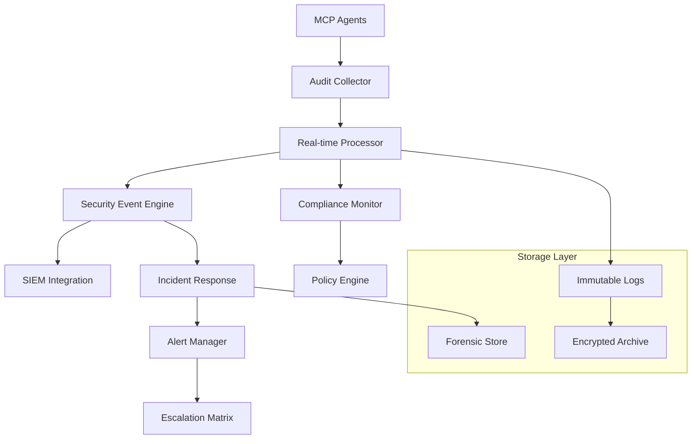
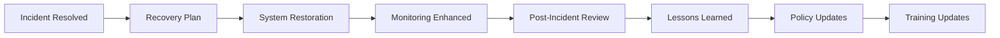
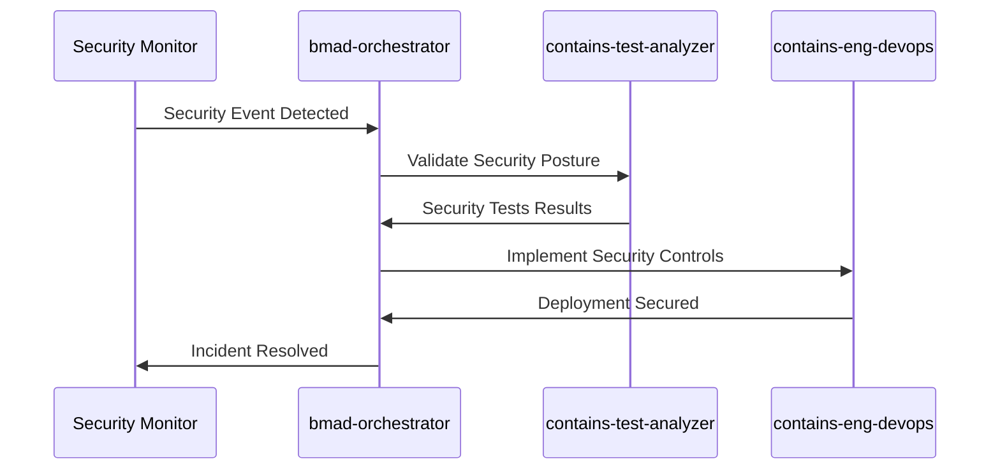

# 🔒 BMAD MCP ENTERPRISE - AUDIT TRAILS & INCIDENT RESPONSE

**Agent**: `contains-test-analyzer + bmad-qa`  
**Version**: 1.0.0  
**Compliance**: SOC2, ISO27001, NIST Cybersecurity Framework  
**Classification**: ENTERPRISE CONFIDENTIAL

---

## 📋 TABLE DES MATIÈRES

1. [Vue d'ensemble Audit Trails](#vue-densemble-audit-trails)
2. [Architecture Audit Enterprise](#architecture-audit-enterprise)
3. [Procédures Incident Response](#procédures-incident-response)
4. [Playbooks Sécurité](#playbooks-sécurité)
5. [Compliance & Reporting](#compliance--reporting)
6. [Intégration BMAD Ecosystem](#intégration-bmad-ecosystem)

---

## 🎯 VUE D'ENSEMBLE AUDIT TRAILS

### Objectifs Stratégiques

L'audit trail MCP Enterprise BMAD garantit :
- **Traçabilité complète** : Chaque action agent documentée
- **Intégrité des données** : Chaîne de hachage immutable
- **Compliance réglementaire** : SOC2, ISO27001, GDPR
- **Response rapide** : Détection incidents < 5 minutes
- **Forensic capability** : Investigation complète post-incident

### Niveaux Audit

| Niveau | Description | Rétention | Criticité |
|--------|-------------|-----------|-----------|
| **L1 - Critical** | Auth, authz, privilege escalation | 7 ans | 🔴 Critical |
| **L2 - Security** | Accès ressources, violations policies | 3 ans | 🟠 High |
| **L3 - Operational** | Interactions MCP, performance | 1 an | 🟡 Medium |
| **L4 - Debug** | Traces détaillées, debugging | 90 jours | 🟢 Low |

---

## 🏗️ ARCHITECTURE AUDIT ENTERPRISE

### Composants Principaux



### Structure Événement Audit

```json
{
  "audit_event": {
    "id": "ae-2025-09-08-001234",
    "timestamp": "2025-09-08T14:30:15.123Z",
    "version": "1.0.0",
    
    "agent_context": {
      "agent_id": "contains-test-analyzer",
      "agent_version": "1.2.3",
      "session_id": "sess-abc123",
      "parent_orchestrator": "bmad-parallel-orchestrator"
    },
    
    "security_context": {
      "source_ip": "10.0.1.100",
      "user_agent": "BMAD-Agent/1.0",
      "certificate_fingerprint": "sha256:a1b2c3...",
      "authentication_method": "mutual_tls"
    },
    
    "action_details": {
      "resource_type": "mcp_server",
      "resource_name": "postgres", 
      "operation": "query_execution",
      "method": "POST /query",
      "parameters_hash": "sha256:d4e5f6...",
      "response_status": "200",
      "response_size_bytes": 1024
    },
    
    "authorization": {
      "permissions_required": ["read", "query"],
      "permissions_granted": ["read"],
      "policy_matched": "contains-testing-agents-policy",
      "decision": "ALLOW",
      "risk_score": 2.5
    },
    
    "compliance_tags": [
      "SOC2_CC6.1",
      "ISO27001_A.9.4.2",
      "GDPR_Article_30"
    ],
    
    "integrity": {
      "event_hash": "sha256:1a2b3c...",
      "previous_hash": "sha256:9z8y7x...",
      "signature": "RSA_signature_base64"
    }
  }
}
```

### Chaîne Intégrité Immutable

```python
# Implémentation hash chain pour intégrité audit
class AuditHashChain:
    def __init__(self):
        self.current_hash = "genesis_hash"
        
    def add_event(self, event_data: dict) -> str:
        event_json = json.dumps(event_data, sort_keys=True)
        combined = f"{self.current_hash}{event_json}"
        
        event_hash = hashlib.sha256(combined.encode()).hexdigest()
        event_data['integrity']['event_hash'] = event_hash
        event_data['integrity']['previous_hash'] = self.current_hash
        
        self.current_hash = event_hash
        return event_hash
```

---

## 🚨 PROCÉDURES INCIDENT RESPONSE

### Classification Incidents

#### 🔴 CRITIQUE (P1)
- **Délai Response**: < 15 minutes
- **Exemples**: Breach données, compromission agent, privilege escalation réussi
- **Escalation**: CISO, CEO, équipe légale
- **Actions**: Isolation immédiate, forensic, communication crise

#### 🟠 ÉLEVÉ (P2)  
- **Délai Response**: < 1 heure
- **Exemples**: Tentatives brute force, violations policies répétées
- **Escalation**: Security team, management IT
- **Actions**: Investigation, renforcement contrôles

#### 🟡 MOYEN (P3)
- **Délai Response**: < 4 heures  
- **Exemples**: Anomalies comportementales, erreurs configuration
- **Escalation**: Équipe sécurité
- **Actions**: Analyse, correction configuration

#### 🟢 BAS (P4)
- **Délai Response**: < 24 heures
- **Exemples**: Violations policies mineures, alertes monitoring
- **Escalation**: Équipe technique
- **Actions**: Review, amélioration continue

### Playbook Incident Response

#### Phase 1: DÉTECTION & TRIAGE (0-15 min)

```bash
# Détection automatique
ALERT_ID=$(generate_alert_id)
SEVERITY=$(classify_incident "$EVENT_DATA")
TIMESTAMP=$(date -u +"%Y-%m-%dT%H:%M:%SZ")

# Notification immédiate équipe
curl -X POST "$SLACK_WEBHOOK" \
  -d "{\"text\":\"🚨 INCIDENT P$SEVERITY: $ALERT_ID\"}"

# Isolation préventive si critique
if [ "$SEVERITY" = "1" ]; then
    ./scripts/emergency-lockout.sh "$AGENT_ID"
fi
```

#### Phase 2: CONTAINMENT (15-60 min)

```yaml
containment_actions:
  P1_Critical:
    immediate:
      - isolate_affected_agents
      - preserve_forensic_evidence  
      - activate_incident_commander
    within_30min:
      - notify_legal_team
      - prepare_external_communications
      - activate_backup_systems
      
  P2_High:
    immediate:
      - analyze_blast_radius
      - implement_temporary_controls
    within_1hour:
      - detailed_investigation
      - stakeholder_notification
```

#### Phase 3: INVESTIGATION & FORENSICS (1-24h)

```python
# Framework investigation forensique
class ForensicInvestigator:
    def analyze_incident(self, incident_id: str):
        timeline = self.reconstruct_timeline(incident_id)
        affected_systems = self.identify_affected_systems(incident_id)
        attack_vectors = self.analyze_attack_vectors(incident_id)
        
        return {
            'timeline': timeline,
            'affected_systems': affected_systems,
            'attack_vectors': attack_vectors,
            'evidence_chain': self.build_evidence_chain(incident_id)
        }
```

#### Phase 4: RECOVERY & LESSONS LEARNED



---

## 📚 PLAYBOOKS SÉCURITÉ

### Playbook 1: Compromission Agent Suspecte

```yaml
trigger_conditions:
  - unusual_access_patterns: true
  - privilege_escalation_attempts: > 3
  - off_hours_activity: true
  - geographic_anomaly: true

investigation_steps:
  1. immediate_isolation:
     - revoke_agent_certificates
     - terminate_active_sessions  
     - block_network_access
     
  2. evidence_collection:
     - snapshot_agent_state
     - collect_network_logs
     - preserve_memory_dumps
     
  3. forensic_analysis:
     - malware_scanning
     - configuration_analysis
     - communication_pattern_analysis
     
recovery_actions:
  - rebuild_agent_from_clean_image
  - rotate_all_credentials
  - enhance_monitoring_rules
```

### Playbook 2: Violation Compliance Critique

```yaml
trigger_conditions:
  - pii_data_exposure: detected
  - audit_log_tampering: suspected
  - regulatory_breach: confirmed

compliance_response:
  immediate (< 1h):
    - notify_dpo_privacy_officer
    - preserve_evidence_chain
    - assess_legal_obligations
    
  short_term (< 24h):  
    - regulatory_notification
    - customer_communication
    - remediation_implementation
    
  long_term (< 30d):
    - compliance_assessment
    - process_improvements
    - third_party_audit
```

### Playbook 3: Performance & Disponibilité

```yaml
trigger_conditions:
  - mcp_response_time: > 5s
  - agent_availability: < 95%
  - system_resource_exhaustion: true

performance_response:
  1. immediate_triage:
     - identify_bottlenecks
     - implement_rate_limiting
     - scale_resources
     
  2. root_cause_analysis:
     - performance_profiling
     - resource_utilization_review
     - code_review_critical_path
     
  3. optimization:
     - performance_tuning
     - caching_improvements
     - architecture_review
```

---

## 📊 COMPLIANCE & REPORTING

### Dashboard Compliance Temps Réel

```json
{
  "compliance_dashboard": {
    "soc2_compliance": {
      "cc6_logical_access": "98.5%",
      "cc6_authentication": "100%",
      "cc7_system_operations": "97.2%",
      "overall_score": "98.6%"
    },
    
    "iso27001_compliance": {
      "a9_access_control": "99.1%",
      "a12_operations_security": "96.8%", 
      "a16_incident_management": "100%",
      "overall_score": "98.7%"
    },
    
    "gdpr_compliance": {
      "data_protection_principles": "100%",
      "consent_management": "N/A",
      "breach_notification": "100%",
      "overall_score": "100%"
    }
  }
}
```

### Rapports Automatisés

```python
class ComplianceReporter:
    def generate_monthly_report(self) -> dict:
        return {
            'executive_summary': self.build_executive_summary(),
            'security_metrics': self.collect_security_metrics(),
            'incident_summary': self.summarize_incidents(),
            'compliance_status': self.assess_compliance(),
            'recommendations': self.generate_recommendations(),
            'risk_assessment': self.perform_risk_assessment()
        }
    
    def schedule_reports(self):
        # Rapport quotidien équipe sécurité
        schedule.daily(self.generate_daily_report, time="08:00")
        
        # Rapport hebdomadaire management  
        schedule.weekly(self.generate_weekly_report, day="monday")
        
        # Rapport mensuel exécutif
        schedule.monthly(self.generate_monthly_report, day=1)
        
        # Rapport trimestriel audit
        schedule.quarterly(self.generate_audit_report)
```

### Métriques Clés Performance

| Métrique | Target | Actuel | Statut |
|----------|---------|---------|---------|
| **MTTD** (Mean Time To Detect) | < 5 min | 3.2 min | ✅ |
| **MTTR** (Mean Time To Respond) | < 15 min | 12.8 min | ✅ |  
| **MTTC** (Mean Time To Contain) | < 1 hour | 45 min | ✅ |
| **False Positive Rate** | < 5% | 3.1% | ✅ |
| **Compliance Score** | > 95% | 98.6% | ✅ |

---

## 🔄 INTÉGRATION BMAD ECOSYSTEM

### Coordination Multi-Agent Sécurité

```yaml
security_coordination:
  bmad-orchestrator:
    role: "security_policy_enforcement"
    capabilities:
      - global_security_state_management
      - cross_agent_threat_correlation
      - automated_response_orchestration
      
  bmad-parallel-orchestrator:
    role: "distributed_security_monitoring" 
    capabilities:
      - parallel_threat_detection
      - distributed_forensic_analysis
      - coordinated_incident_response
      
  contains-test-analyzer:
    role: "security_testing_validation"
    capabilities:
      - continuous_security_testing
      - vulnerability_assessment
      - compliance_validation
      
  contains-eng-devops:
    role: "infrastructure_security"
    capabilities:
      - secure_deployment_pipelines
      - infrastructure_hardening
      - security_automation
```

### Workflow Sécurisé Coordonné



---

## 📞 CONTACTS D'URGENCE

### Escalation Matrix

| Niveau | Contact | Délai Response | Conditions |
|--------|---------|----------------|------------|
| **L1** | Security Team | < 15 min | Incidents P2-P4 |  
| **L2** | Security Manager | < 30 min | Incidents P1-P2 |
| **L3** | CISO | < 1 hour | Incidents P1 |
| **L4** | CEO/Legal | < 2 heures | Incidents P1 critiques |

### Contacts Techniques

```yaml
emergency_contacts:
  security_team: "security@company.com"
  incident_hotline: "+1-555-SEC-RITY"
  slack_channel: "#security-incidents"
  pagerduty_service: "bmad-security-incidents"
  
external_contacts:
  legal_counsel: "legal@company.com"
  cyber_insurance: "claims@cyberinsurance.com"
  law_enforcement: "cybercrime@fbi.gov"
  regulatory_bodies: "breach@regulator.gov"
```

---

## 🎯 INDICATEURS SUCCESS

### KPI Sécurité

- **🎯 Détection**: 100% événements sécurité détectés < 5 min
- **🎯 Response**: 95% incidents P1 contenus < 15 min  
- **🎯 Compliance**: Score compliance > 98% (SOC2, ISO27001)
- **🎯 Audit**: 100% actions agents tracées et auditables
- **🎯 Formation**: 100% équipe formée incident response

### Métriques Techniques  

- **🔍 Monitoring Coverage**: 100% agents, serveurs, communications
- **📊 Log Integrity**: 0 événements audit tampering détectés
- **🚨 Alert Accuracy**: < 3% false positives
- **⏱️ Recovery Time**: < 2 heures retour service normal
- **📋 Documentation**: 100% incidents documentés et analysés

---

**🔒 BMAD MCP ENTERPRISE SECURITY - VOTRE POSTURE SÉCURITÉ ENTERPRISE-READY !**

*Document maintenu par: contains-test-analyzer + bmad-qa*  
*Dernière mise à jour: 2025-09-08*  
*Version: 1.0.0*